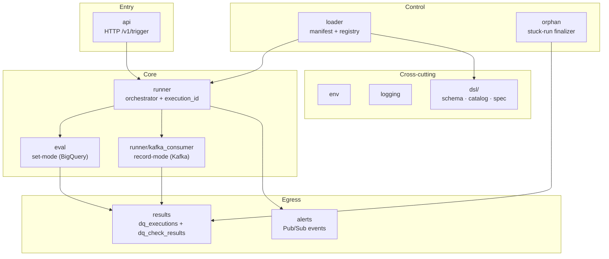

<!-- path: docs/architecture/component-map.md -->

# Component Map

What lives where. This file develops mental-model anchor **#5**
from the [overview README](./README.md): workspace boundaries and
the components inside each workspace.

---

## Five workspaces

The repository is a monorepo with five workspaces. Each has a
distinct identity and rejects content that belongs in another.

- **`engine/`** — the runtime. Owns the DSL schema, every compiler
  and handler, the trigger API, the runner, the result writers,
  the alert emitter, and the binary that ties them together.
- **`rules/`** — the authoring surface. Rule YAMLs by entity,
  `_owners.yaml`, contributor-facing examples. No executable logic.
- **`tools/`** — auxiliary CLIs supporting both rules workflow and
  engine operations. Small, focused binaries — not a second engine.
- **`deploy/`** — Kubernetes manifests, environment definitions,
  OIDC and Workload Identity configuration. Tool-neutral base +
  per-env overlays per
  [ADR-0019](../adr/0019-infrastructure-tooling.md).
- **`docs/`** — cross-workspace documentation. Architecture
  (this directory), ADRs, glossary, governance, runbooks.

The boundary contract between `engine/` and `rules/` is the most
load-bearing of these — see
[ADR-0001](../adr/0001-engine-rules-compatibility.md).

---

## Engine packages (`engine/internal/`)

Eleven internal packages, grouped here by their layer in the
architecture. Layer names match
[ADR-0025](../adr/0025-aggregation-and-runner-shape.md)'s
unified-runner model.

### Entry

| Package | Responsibility |
|---|---|
| `api/` | `/v1/trigger` HTTP handler. OIDC validation, strict request decoder, panic-safe dispatch. Contract: [ADR-0014](../adr/0014-trigger-handler-contract.md). |

### Control

| Package | Responsibility |
|---|---|
| `loader/` | Manifest fetch + rule registry build. Fail-fast loading; refuses to swap on partial / inconsistent state. |
| `orphan/` | Detects orphan runs (executions stuck in `running` past a deadline) and finalizes them to `aborted` per [ADR-0007](../adr/0007-loader-scheduler-retry-failure-semantics.md) CC11. |

### Core

| Package | Responsibility |
|---|---|
| `runner/` | Orchestrates one execution attempt. Computes `execution_id` per [ADR-0002](../adr/0002-run-identity-and-idempotency.md), dispatches by mode, sequences result writes and alert emission. |
| `eval/` | Set-mode evaluator. Compiles a check into BigQuery SQL, executes the query, returns the per-check outcome. Owns the `cloud.google.com/go/bigquery` dependency so the rest of the engine doesn't import it. |
| `runner/kafka_consumer.go` | Record-mode handler (inside the runner package per the unified-runner model). Consumes a tumbling Kafka window, evaluates each record through the kind handler, aggregates at window close per [ADR-0026](../adr/0026-failure-scope-aggregated.md). |

### Egress

| Package | Responsibility |
|---|---|
| `results/` | Writers for `dq_executions` and `dq_check_results`. Owns the BigQuery destination schema for both tables per [ADR-0003](../adr/0003-result-write-model.md). |
| `alerts/` | Pub/Sub event emission and deduplication per [ADR-0006](../adr/0006-alert-routing-contract.md). Distinguishes data-quality events from operational events at the category boundary. |

### DSL surface

| Package | Responsibility |
|---|---|
| `dsl/schema/` | JSON Schema documents (`v1.schema.json`, `v2.schema.json`) — the source of truth for the rule format. The mirror at `rules/_schema/` is kept byte-equal by CI. |
| `dsl/catalog/` | Engine-side view of the closed kind catalog (`v1.yaml`) per [ADR-0022](../adr/0022-kind-catalog.md). |
| `dsl/spec/` | Rule YAML parser — produces the in-memory rule representation the runner consumes. |

### Cross-cutting

| Package | Responsibility |
|---|---|
| `env/` | Typed per-environment configuration (`local.go`, `qa.go`, `prod.go`) per [ADR-0018](../adr/0018-environment-configuration-model.md). Reflect-based exhaustiveness test forbids zero-value fields. |
| `logging/` | slog handler with longest-prefix per-package levels driven by `DQ_LOG_LEVELS` per [ADR-0043](../adr/0043-logging-contract-specifics.md). |

### Binary

`engine/cmd/dq-engine/` — the long-running engine binary. Wires
config, logger, loader, runner, API server, orphan detector, and
shutdown drain.

---

## Tools (`tools/`)

Five auxiliary CLIs. Each one focused on a single concern.

| Tool | Responsibility |
|---|---|
| `tools/lint/` | DQ rules linter. Validates rule YAMLs against the schema, applies project-specific lint rules (naming, partition discipline, mode consistency per [ADR-0021](../adr/0021-mode-as-primitive.md)), can optionally check owner ↔ CODEOWNERS group consistency per [ADR-0037](../adr/0037-owner-codeowners-cross-check.md). |
| `tools/manifest/` | Manifest publisher. Generates a manifest from `rules/` content, writes content-addressed bodies and atomically swaps `latest.json` per [ADR-0005](../adr/0005-manifest-publication-semantics.md). The `set-pointer` subcommand handles rollback per [ADR-0036](../adr/0036-set-pointer-subcommand.md). |
| `tools/dryrun/` | BigQuery dry-run cost estimator for set-mode checks. Reports bytes-scanned per rule against the operator-declared substrate. |
| `tools/migrate/` | Schema-version migration helper. Moves a rule YAML from `version: 1` to `version: 2` per [ADR-0035](../adr/0035-compatibility-window-duration.md) and the v1 → v2 transition rules of [ADR-0021](../adr/0021-mode-as-primitive.md). |
| `tools/pathsafe/` | Validates external artifact references (`_ref` fields) in rule YAMLs per [ADR-0044](../adr/0044-external-artifact-references.md). |

---

## Component map (engine internals)

The diagram below shows the actual import edges between engine
packages. Read top to bottom: a request enters at the top, results
exit at the bottom. Cross-cutting packages (`env`, `logging`, `dsl`)
are consumed by everything — they are drawn separately to keep the
main flow legible.

Two invariants the diagram encodes: (1) no back-edges into
entry/control — the runner consumes their outputs, never calls
back; (2) the runner does not import BigQuery — the set-mode
dependency on `cloud.google.com/go/bigquery` is isolated inside
`eval/`, so the runner stays mode-agnostic above the dispatch.
