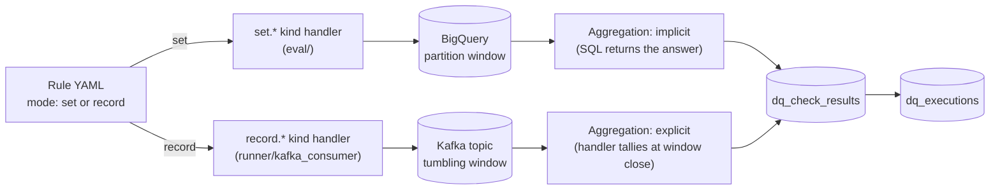

<!-- path: docs/architecture/multi-mode-overview.md -->

# Multi-mode Overview

The DQ Platform evaluates data quality in two modes. Both modes
share the same rule grammar, the same result store, the same alert
egress, and the same `execution_id` formula. They differ only in
what kind of data they read and how that data is bounded.

This file develops mental-model anchors **#1** and **#2** from the
[overview README](./README.md).

---

## Why two modes

Curated data arrives in two shapes inside the organization:

- **Set-shaped** — landed into a BigQuery table or view. A check
  asks a question about a bounded row set ("does this partition
  have any rows?", "is this column never null in this window?").
- **Record-shaped** — flowing through a Kafka topic. A check asks
  a question about individual records inside a bounded time window
  ("are 99%+ of records in this 5-minute window schema-conformant?").

A single-mode engine would either reject one of these shapes or
twist itself to accommodate both. The platform commits to both as
first-class primitives — they share a runtime contract and a result
contract — and uses the **mode** discriminator to keep them honest.

The commitment is made by
[ADR-0020](../adr/0020-wave-s-launch.md) (Wave-S launch) and
[ADR-0021](../adr/0021-mode-as-primitive.md) (mode as primitive).

---

## Set-oriented mode

A `set` check operates over a bounded set of rows read from a
partitioned BigQuery table or view. The compiler translates the
check into a parameterized BigQuery query bounded by the rule's
declared partition window; the runner executes the query; one
execution produces one result per check.

- Source: BigQuery table or view (declared per
  [ADR-0023](../adr/0023-sources-schema.md)).
- Window: a partition range (e.g., a single day on a daily-
  partitioned table).
- Aggregation: **implicit** in the SQL — the query itself returns
  the count, ratio, or boolean the check needs.
- Evidence: sample violating rows up to a per-environment limit.
- Cost guardrails: scan-bytes ceiling per run, max window duration,
  concurrency budgets (per
  [ADR-0029](../adr/0029-bigquery-cost-ceilings.md)).

---

## Record-oriented mode

A `record` check operates on individual records consumed from a
Kafka topic, inside a tumbling watermark-bounded window. The runner
consumes the window's records, evaluates each one through the kind
handler, and aggregates the per-record outcomes into a single check
result at window close.

- Source: Kafka topic + consumer group (per
  [ADR-0023](../adr/0023-sources-schema.md)).
- Window: tumbling watermark-bounded interval declared in the
  source block (per [ADR-0024](../adr/0024-window-semantics.md)).
- Aggregation: **explicit** inside the kind handler — per-record
  outcomes are tallied; the violation rate is mapped to the outcome
  enum via threshold (per
  [ADR-0026](../adr/0026-failure-scope-aggregated.md)).
- Evidence: sampled violating records, bounded by writer-queue
  saturation and sample-size ceilings (per
  [ADR-0027](../adr/0027-record-mode-cost-guardrails.md)).
- Cost guardrails: consumer lag, late-drop rate, dead-letter rate,
  throughput, evidence sample size, writer-queue saturation (per
  [ADR-0027](../adr/0027-record-mode-cost-guardrails.md)).

---

## DSL surface: where the discriminator lives

`mode` is declared in **four artifacts** and the linter cross-checks
all four for consistency:

1. **On the rule** — `mode: set` or `mode: record` at the top level.
2. **On the entity** — same field, same value (an entity cannot host
   rules of mixed mode).
3. **On every kind name** — kind names carry the mode as a prefix
   (`set.row_count_positive`, `record.schema_conformance`, …)
   under the closed catalog at
   [`engine/internal/dsl/catalog/v1.yaml`](../../engine/internal/dsl/catalog/v1.yaml)
   (per [ADR-0022](../adr/0022-kind-catalog.md)).
4. **On the source declaration** — `source.type: bigquery` for set
   mode; `source.type: kafka` for record mode (per
   [ADR-0023](../adr/0023-sources-schema.md)).

Any inconsistency among the four is a lint failure before the rule
ever reaches the engine. This is what keeps the unified runner
(below) safe.

---

## The two paths

The platform runs both modes through a **single runner** that
dispatches by mode (committed by
[ADR-0025](../adr/0025-aggregation-and-runner-shape.md)). There is
no parallel set-runner / record-runner; there is one runner with a
per-mode handler.

Everything below the aggregation node is identical across modes —
the result store, the alert egress, the `execution_id` formula
(per [ADR-0002](../adr/0002-run-identity-and-idempotency.md)).

---

## Stream substrate asymmetry: Kafka in, Pub/Sub out

Kafka is the **ingress** substrate for record-mode checks. Pub/Sub
is the **egress** substrate for alert and result events. The
asymmetry is intentional:

- Kafka's consumer-group and partition-offset model gives the
  engine deterministic replay and window-bounded reads — exactly
  what a record-mode check needs.
- Pub/Sub's at-least-once fan-out to subscribers is what alert
  routing needs — multiple downstream consumers (Slack adapter,
  PagerDuty adapter, on-call dashboards) consuming the same event
  independently.

The substrate capability matrix is amended to carry Kafka rows in
[ADR-0028](../adr/0028-kafka-substrate-row.md). Pub/Sub is not a
source substrate; do not propose it as one.

