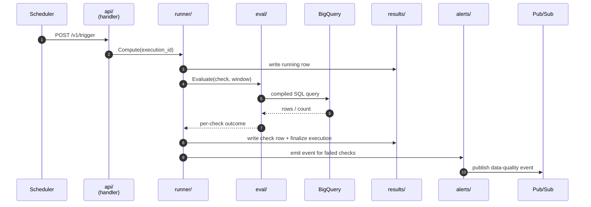
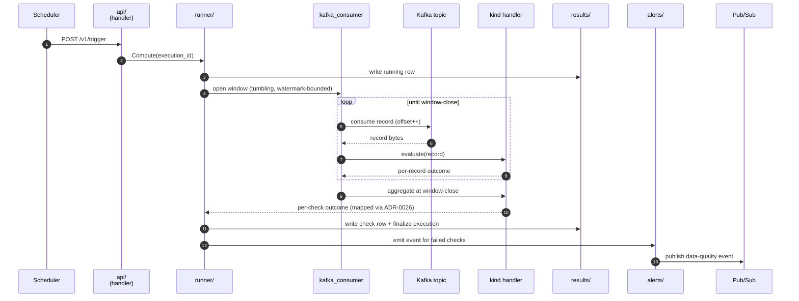

<!-- path: docs/architecture/request-flow.md -->

# Request Flow

This file walks a request from the moment a trigger arrives at
`/v1/trigger` to the moment an alert event lands on Pub/Sub. The
flow has **eight steps** and is identical in shape across both
modes. The two divergences — source read and aggregation point —
are highlighted explicitly.

This file develops mental-model anchors **#3** (result store) and
**#4** (alert egress) from the [overview README](./README.md).

---

## The eight steps

1. **Trigger arrives.** A scheduler or operator POSTs to
   `/v1/trigger`. The `api/` handler validates OIDC, decodes the
   request strictly (UTF-8, no pipe character, RFC 3339 timestamps),
   and is panic-safe (any handler panic emits a Pub/Sub alert).
   Contract: [ADR-0014](../adr/0014-trigger-handler-contract.md).

2. **`execution_id` is computed** via `runner.Compute`:
   `sha256_hex(ruleset_version | entity | window_start | window_end | trigger_source)`
   per [ADR-0002](../adr/0002-run-identity-and-idempotency.md).
   Scheduler replays compute the same id; operator reruns (different
   `trigger_source`) get a new id linked to the original via audit
   metadata.

3. **The running row is persisted** to `dq_executions` with status
   `running` and per-attempt metadata before any check runs. This is
   what makes orphan detection possible
   ([ADR-0007](../adr/0007-loader-scheduler-retry-failure-semantics.md)
   CC11).

4. **The runner dispatches by mode** — **first per-mode divergence**:
   - **Set:** `runner` → `eval/` compiles the check to a BigQuery
     query bounded by the partition window, executes, returns the
     per-check result. SQL aggregation is implicit.
   - **Record:** `runner` → `kafka_consumer.go` opens a consumer-group
     subscription, consumes the tumbling watermark-bounded window,
     feeds each record to the kind handler.

   Sources: [ADR-0023](../adr/0023-sources-schema.md). Windows:
   [ADR-0024](../adr/0024-window-semantics.md). Unified runner:
   [ADR-0025](../adr/0025-aggregation-and-runner-shape.md).

5. **Aggregation at window close** — **second per-mode divergence**:
   - **Set:** implicit (the SQL returns the answer).
   - **Record:** the kind handler tallies per-record outcomes and
     maps the violation rate to the outcome enum via threshold
     ([ADR-0026](../adr/0026-failure-scope-aggregated.md);
     per-rule overrides via `params.aggregation`).

6. **Per-check rows written; execution row finalized.** `results/`
   writes one row per check to `dq_check_results` and updates the
   parent `dq_executions` row to a terminal status —
   `success` / `failed` / `error` / `aborted` per
   [ADR-0004](../adr/0004-failure-scope.md). The enum is identical
   across modes.

7. **Events emitted for non-passing checks.** `alerts/` publishes a
   structured event to Pub/Sub carrying `execution_id`, `check_id`,
   outcome, bounded evidence summary, and owner resolved from
   `rules/_owners.yaml` per
   [ADR-0006](../adr/0006-alert-routing-contract.md). Engine-side
   dedup windows prevent floods on the same `(check_id, window)`.

8. **Alert consumers fan out.** Subscribers (Slack adapter, PagerDuty
   adapter, on-call dashboards) consume the Pub/Sub topic
   independently and route based on the resolved owner. Consumer-side
   dedup handles fan-out idempotency. The onboarding-channel override
   ([ADR-0046](../adr/0046-onboarding-channel-override.md)) is
   applied at the consumer.

---

## Set-mode sequence

---

## Record-mode sequence

The two sequences are structurally identical above the dispatch
and below the aggregation. Everything in `results/`, `alerts/`,
and Pub/Sub is mode-agnostic.

---

## Outcome enum (set and record)

Both modes terminate in one of the four outcomes from
[ADR-0004](../adr/0004-failure-scope.md):

| Outcome | Set-mode meaning | Record-mode meaning |
|---|---|---|
| `pass` | SQL result satisfies the threshold | violation rate at or below the configured threshold |
| `fail` | SQL result violates the threshold | violation rate above the configured threshold |
| `error` | SQL execution failed | window read failed (Kafka error, decode error) |
| `aborted` | execution row never reached terminal status (orphan-detector finalized) | same |

`degraded` is not a fifth outcome — it is a refinement carried in
the alert payload when the run completes but a guardrail (cost
ceiling, consumer lag, late-drop rate) was breached.

---

## Where to look in the code

Trigger entry: `engine/internal/api/handler.go`. `execution_id`:
`runner/execution_id.go`. Running row + finalize: `runner/runner.go`.
Set-mode evaluation: `eval/evaluator.go`. Record-mode consumption:
`runner/kafka_consumer.go`. Result writes:
`results/bigquery_store.go`. Alert emission:
`alerts/pubsub_publisher.go`.
